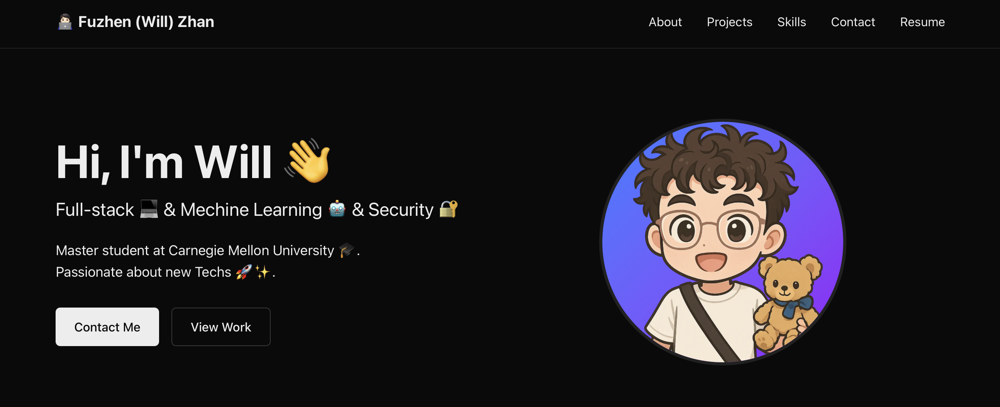

# Personal Portfolio Website - Fuzhen(Will) Zhan



A modern, responsive portfolio website built with Next.js, TypeScript, and Tailwind CSS. This portfolio showcases my professional experience, projects, and skills in full-stack development, machine learning, and information security.

## Features

- 🎨 Modern and responsive design
- ⚡ Fast performance with Next.js
- 📱 Mobile-first approach
- 🎭 Smooth animations and transitions
- 🎯 SEO optimized
- 🌙 Dark mode support

## Tech Stack

- **Framework**: Next.js 14
- **Language**: TypeScript
- **Styling**: Tailwind CSS
- **Deployment**: Vercel

## Getting Started

```bash
npm install
# or
yarn install
```

## Run the development server:

```bash
npm run dev
# or
yarn dev
```

## Project Structure

- `src/app/` - Main application pages and components
- `src/components/` - Reusable React components
- `public/` - Static assets like images and fonts
- `tailwind.config.js` - Tailwind CSS configuration

## Contact

Feel free to reach out to me through:

- Email: fzhan@andrew.cmu.edu
- LinkedIn: https://linkedin.com/in/fuzhen-zhan
- GitHub: https://github.com/dadaWilliam

## License

MIT License - feel free to use this template for your own portfolio!
